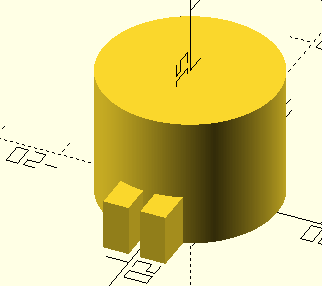
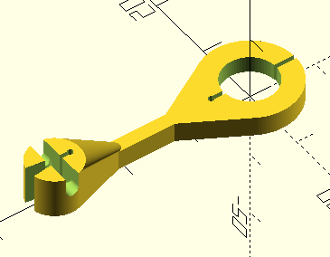

# Collinear 2

* OpenSCAD to for 3D printable parts to assist construction of the antenna
  * Choose what to render by commenting / uncommenting appropriate module in the last 3 lines
  
* Based on the design in the mobile fish website
  * [Youtube](https://www.youtube.com/watch?v=OwNiL4402kM)
  * [Slides](https://www.mobilefish.com/download/lora/lora_part46.pdf)
    * Collinear 2 starts at page 70
  * Lora 868 Mhz (eg, meshtastic EU868)

* See comments in the code
  * Can customize for different wire sizes
  * Loop form size can be changed 

* My antenna used
  * 2.5mm² (1.8mm dia) copper wire
  * Designed for 868 Mhz

* Check the [stl](stl) dir for pre rendered STLs

